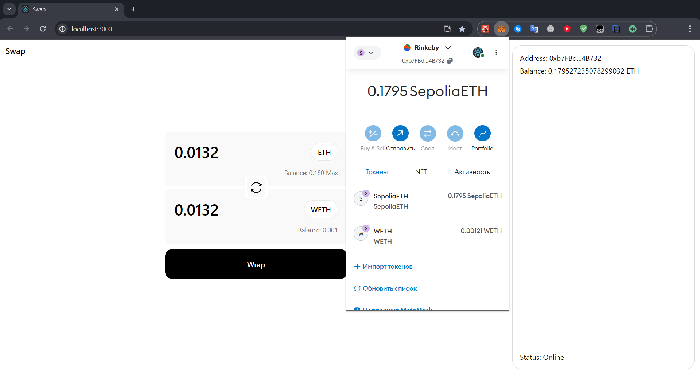

<h1>React.js + Ethers.js Web3 Crypto Swap App</h1>



## Technology Stack

<ul>
  <li>▶️ React.js</li>
  <li>✨ React-hook-form</li>
  <li>💱 Ethers.js (v6+)</li>
</ul>

## Site Functional

<ul>
  <li>Connection to MetaMask</li>
  <li>Swap ETH to WETH</li>
  <li>Swap WETH to ETH</li>
  <li>User data output (Address, ETH/WETH balance)</li>
</ul>

## Getting Started

<p>To start work, connect to the "Sepolia" test network, use a third-party site to obtain a test balance. To see your WETH in MetaMask, go to the "Tokens" section, click "import token", enter the address of the used contract.

> Contract address:
```js 
  0xDB025C65B9c7b0Fc28a53Bd32378FC5BdD1288Ac
```

<p>And click "Next"</p>